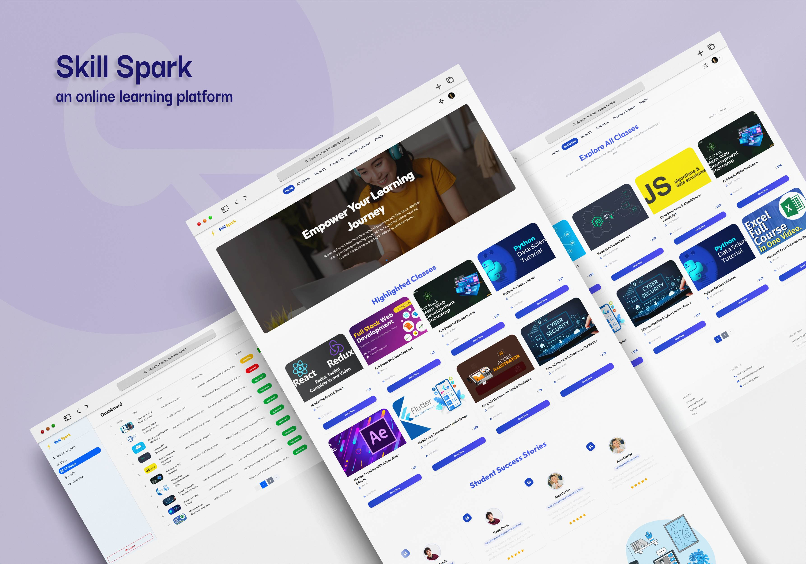

# Skill Spark – an online learning platform


🚀 **Live Site:** [https://skill-sparkx.netlify.app](https://skill-sparkx.netlify.app)  
🛠️ **Admin Credentials**  
- **Email:** `admin@hero.com`  
- **Password:** `admin1234`  

---


## 📚 About Skill Spark

**Skill Spark** is a modern web application built using the **MERN stack** (MongoDB, Express.js, React, Node.js) designed to streamline and enhance the experience of educational institutions, teachers, and students. It empowers teachers to manage classes, students to engage and enroll in learning, and admins to control and oversee the entire platform from one dashboard.

---

## 🌟 Features

1. 🔒 **Authentication System**  
   - Email/password and Google sign-in
   - JWT-based secure access with private routing

2. 🎓 **Role-Based Dashboards**  
   - Student, Teacher, and Admin dashboards with distinct features and routes

3. 🧑‍🏫 **Teacher Application & Class Management**  
   - Teachers can apply, add/edit/delete courses, manage assignments, and track class progress

4. 💳 **Stripe Payment Integration**  
   - Secure class enrollment with real-time payment and transaction tracking

5. 📊 **Admin Control Panel**  
   - Manage users, approve/reject teacher applications, control class status, and view class progress

6. ✍️ **Teaching Evaluation & Feedback System**  
   - Students can submit Teaching Evaluation Reports (TER) with ratings and reviews

7. 🗃️ **React Query (TanStack)**  
   - Efficient state management for GET and POST (mutations) requests

8. 📱 **Fully Responsive Design**  
   - Optimized for mobile, tablet, and desktop viewports, including dashboard responsiveness

9. 🎉 **Interactive UI/UX**  
   - Real-time feedback with SweetAlert2 and toast notifications for all major actions

10. 📈 **Live Data Statistics**  
    - Dashboard stats for total users, classes, enrollments, and assignment submissions

---

## 🛠️ Tech Stack

- **Frontend:** React, TailwindCSS, DaisyUI, React Hook Form, React Icons, Swiper, Lottie
- **Backend:** Node.js, Express.js, MongoDB, Stripe API
- **Authentication:** Firebase Auth + JWT
- **State Management:** TanStack React Query (v5.82.0)
- **UI Enhancements:** SweetAlert2, React Hot Toast, HeadlessUI, React Rating Stars

---

## 📦 NPM Packages Used

- `headlessUI` - Accessible UI components  
- `stripe-js` - Stripe payment integration  
- `tailwindcss` - Utility-first CSS framework with Vite plugin  
- `@tanstack-query` - Data fetching and caching  
- `axios` - HTTP client for API requests  
- `daisyUI` - Tailwind CSS component library  
- `firebase` - Authentication and backend services  
- `lottie-react` - Animation support for React  
- `react-fast-marquee` - Smooth scrolling marquee component  
- `react-helmet` - Manage document head  
- `react-hook-form` - Form management  
- `react-hot-toast` - Toast notifications  
- `react-icons` - SVG icons as React components  
- `react-router` - Routing in React apps  
- `react-simple-star-rating` - Star rating component  
- `sweetalert2` - Beautiful alert modals  
- `swiper` - Touch sliders/carousels  

---

### 🚀 Run the Project Locally:

1. **Clone the Repository**

```bash
https://github.com/noboKumar/skill-spark-client.git
cd skill-spark

```

2. **Install Dependencies**

```bash
npm install
```

3. **Set Environment Variables**

Create a `.env` file in the root directory:

```env
VITE_FIREBASE_API_KEY=your_api_key
VITE_FIREBASE_AUTH_DOMAIN=your_project.firebaseapp.com
VITE_FIREBASE_PROJECT_ID=your_project_id
VITE_FIREBASE_STORAGE_BUCKET=your_project.appspot.com
VITE_FIREBASE_MESSAGING_SENDER_ID=your_sender_id
VITE_FIREBASE_APP_ID=your_app_id
VITE_IMGBB_API_KEY =your_imgbb_API_key
VITE_API_URL=your_api_url
VITE_STRIPE_PUBLIC_KEY=your_stripe_public_key

VITE_SERVER_URL=http://localhost:5000
```

4. **Start the Development Server**

```bash
npm run dev
```

> App will run at **[http://localhost:5173](http://localhost:5173)**

---

### 🔧 Backend Setup (Node.js + Express)


```bash
https://github.com/noboKumar/skill-spark-server.git
cd skill-spark-server

```

2. **Install Backend Dependencies**

```bash
npm install
```

3. **Create a `.env` file**

```env
PORT=5000
MONGODB_URI=your_mongodb_connection_string
JWT_SECRET=your_jwt_secret
STRIPE_SECRET_KEY=your_stripe_secret_key
PORT=3000
```

4. **Start the Backend Server**

```bash
npm run dev
```

> Server will run at **[http://localhost:3000](http://localhost:3000)**

---